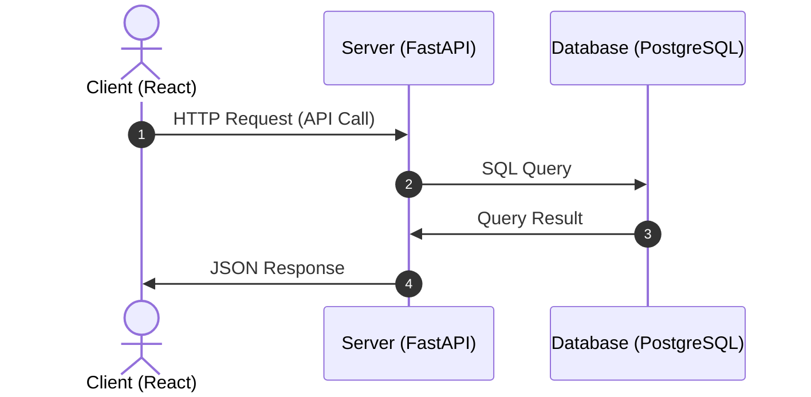

# Template Utils

## Overview

A comprehensive project template that provides a ready-to-use development environment with modern tooling and best practices. This template accelerates project setup by including pre-configured development containers, GitHub workflows, and standardized templates for issues and pull requests.

## Features

### 🚀 Development Environment Template
- **Dev Containers**: Instant development environment setup with VSCode
- **Docker Compose**: Easy multi-service environment management
- **GitHub Templates**: Standardized issue and PR templates

### 📱 Sample Application
- **Full-Stack Architecture**: 3-tier architecture with React + FastAPI + PostgreSQL
- **Real-time Features**: Instant data updates with button clicks
- **Data Persistence**: Click history management with PostgreSQL
- **API Documentation**: Auto-generated documentation with Swagger UI
- **Responsive UI**: Modern web interface

## Architecture



## Directory Structure

```
.
├── .devcontainer/                # Development container configuration
├── .github/                      # GitHub configuration
│   ├── ISSUE_TEMPLATE/           # GitHub issue templates
│   └── PULL_REQUEST_TEMPLATE/    # GitHub PR templates
├── .vscode/                      # VSCode configuration
├── app/                          # Complete application directory (source code, Docker configs, etc.)
│   ├── client/                   # React frontend application
│   └── server/                   # FastAPI backend application
├── bin/                          # Utility scripts
└── docs/                         # Project documentation
```

> **📖 For detailed information about each service, please refer to their respective README files:**
> - **Client (React)**: [`app/client/README.md`](app/client/README.md)
> - **Server (FastAPI)**: [`app/server/README.md`](app/server/README.md)

## Getting Started

### Prerequisites

- [Docker](https://www.docker.com/)
- [Dev Containers](https://containers.dev/) extension (`anysphere.remote-containers`) for VSCode
- UNIX/Linux-based OS (Windows users should use WSL2)

### Quick Start

1. **Clone the repository**
   ```bash
   git clone <repo-url> <project-name>
   cd <project-name>
   ```

2. **Initialize the project**
   ```bash
   make init
   ```

3. **Open in Dev Container**
   - Press `Ctrl+Shift+P` (or `Cmd+Shift+P` on Mac) in VSCode
   - Type `Dev Containers: Open Folder in Container`
   - Select and execute the command

4. **Start the development environment**
   ```bash
   make up
   ```

5. **Access your application**
   - Open your browser and navigate to: http://localhost:3000
