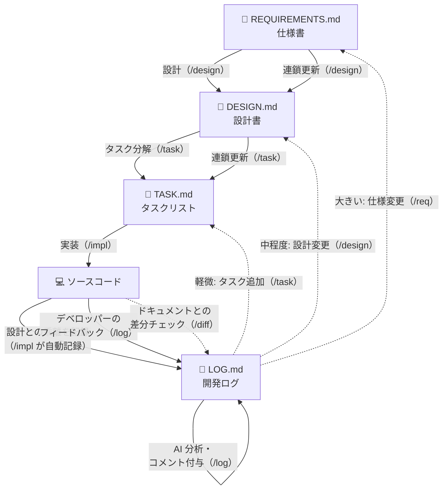

# template.development

## 概要

プロジェクトの立ち上げを加速するための開発テンプレートリポジトリ。標準化されたプロジェクト構成、CI/CD、開発コンテナ、GitHub テンプレート、そして Claude Code によるAI支援開発のスキルセットを同梱している。

## 特徴

- **Dev Containers** — VSCode ですぐに使える開発環境
- **Docker Compose** — マルチサービスの環境管理
- **GitHub テンプレート** — Issue / PR テンプレートの標準化
- **CI/CD** — Prettier, markdownlint, yamllint, actionlint による自動チェック
- **Conventional Commits** — commitlint + husky によるコミット規約の強制
- **Claude Code スキル** — AI支援開発の13スキルセット

## ディレクトリ構成

```text
.
├── app/                    # アプリケーションソースコード
│   ├── client/             # フロントエンド
│   └── server/             # バックエンド
├── docs/                   # プロジェクトドキュメント
│   ├── REQUIREMENTS.md     # 仕様書
│   ├── DESIGN.md           # 設計書
│   ├── TASK.md             # タスクリスト
│   ├── LOG.md              # 開発ログ
│   └── research/           # 市場調査
├── .claude/skills/         # Claude Code カスタムスキル
├── .github/                # GitHub Actions, テンプレート
├── .husky/                 # Git フック
└── .devcontainer/          # 開発コンテナ設定
```

## セットアップ

### 前提条件

- [Docker](https://www.docker.com/)
- [Node.js](https://nodejs.org/)（commitlint, Prettier 用）
- [Dev Containers](https://containers.dev/) 拡張機能（VSCode 用、任意）
- UNIX/Linux 系 OS（Windows は WSL2 を推奨）

### クイックスタート

1. リポジトリをクローンする

   ```bash
   git clone <repo-url> <project-name>
   cd <project-name>
   ```

2. Claude Code でプロジェクトをセットアップする

   ```bash
   /setup
   ```

   `/setup` が依存関係のインストール（`make install`）、各種設定ファイルの更新を一括で行う。

## 開発フローとスキル

このテンプレートは、4つのドキュメントを中心にした開発フローを採用している。各工程に対応する Claude Code スキルを使って AI と協働で開発を進める。



### 順方向（計画→実装）

1. **仕様書を書く**（`/req`）— プロダクトのビジョン、機能要件、非機能要件を定義する
2. **設計書を書く**（`/design`）— 仕様書を基に、実装に迷わないレベルの設計を作成する
3. **タスクに分解する**（`/task`）— 設計書を基に、上から順にやれば完成するタスクリストを作る
4. **実装する**（`/impl`）— タスクリストに従ってコードを書く
5. **レビュー→コミット→PR**（`/review` → `/commit` → `/pr`）

### フィードバックループ

実装中やレビュー後に気づいたことは、開発ログ（LOG.md）に記録する。デベロッパーも AI もログに発言でき、AI が分析してコメントを返し、影響範囲に応じた対応を提案する。

- **軽微**（ボタンの位置ずれ等）→ `/task` でタスク追加して対応
- **中程度**（フィルター機能の追加等）→ `/design` で設計を更新してから `/task` でタスク化
- **大きい**（認証方式の変更等）→ `/req` で仕様から見直し

### 主要なスキル一覧

| スキル             | コマンド    | 説明                                               |
| ------------------ | ----------- | -------------------------------------------------- |
| セッション初期化   | `/init`     | プロジェクトの状態を把握してサマリーを出力する     |
| 仕様書             | `/req`      | REQUIREMENTS.md を作成・更新する                   |
| 設計書             | `/design`   | DESIGN.md を作成・更新する                         |
| タスク分解         | `/task`     | TASK.md の作成、または個別タスクの追加             |
| 実装               | `/impl`     | タスクに従ってコードを書く                         |
| コードレビュー     | `/review`   | 未コミットの変更をレビューする                     |
| 開発ログ           | `/log`      | フィードバックの記録・AI 分析                      |
| ドキュメント差分   | `/diff`     | ドキュメントとコードの乖離を検出して LOG.md に記録 |
| コミット           | `/commit`   | Conventional Commits でコミットする                |
| PR 作成            | `/pr`       | プルリクエストを作成する                           |
| PR 修正            | `/pr-fix`   | CI 失敗 + レビュー指摘を分析し LOG.md に記録する   |
| Makefile 更新      | `/makefile` | プロジェクトに必要なコマンドを Makefile に反映する |
| プロジェクト初期化 | `/setup`    | テンプレートから新規プロジェクトをセットアップする |

### 使い方の例

**新規プロジェクト開始:**

```text
/setup → /req → /design → /task → /impl → /review → /commit → /pr
```

**フィードバック対応:**

```text
/log ここの画面遷移がわかりにくい → /log → /design → /task → /impl
```

**セッション開始:**

```text
/init → 状況を確認 → 作業を開始
```

## コマンド

すべての操作は `make` コマンドから実行する。利用可能なコマンドは `make help` で確認できる。

## ライセンス

[MIT](LICENSE)
